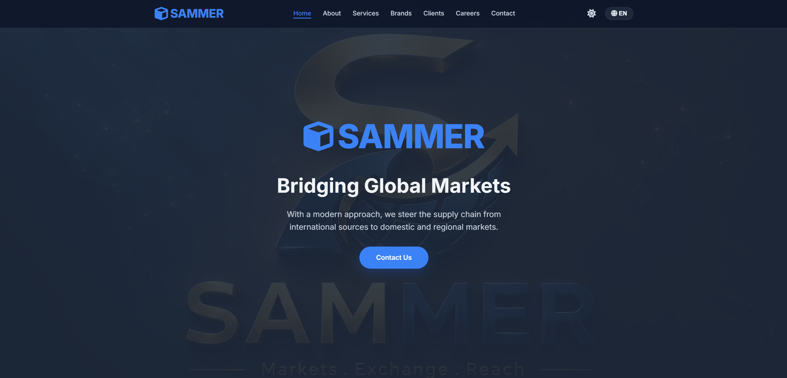

# 🌐 SAMMER | صفحه استقرار رسمی

**SAMMER** یک صفحه فرود (Landing Page) مدرن و حرفه‌ای برای معرفی شرکت بازرگانی بین‌المللی است. این صفحه با طراحی مینیمال، کاملاً ریسپانسیو و دوزبانه (فارسی/انگلیسی) ساخته شده و تجربه‌ای جذاب برای کاربران به ارمغان می‌آورد.

---

## ✨ ویژگی‌های برجسته

- 🌗 **تم روز/شب** با قابلیت ذخیره‌سازی خودکار در مرورگر کاربر
- 🌍 **دو زبان کامل** (فارسی و انگلیسی) با تغییر جهت خودکار صفحه (RTL/LTR)
- 📱 **طراحی کاملاً ریسپانسیو** سازگار با موبایل، تبلت، لپ‌تاپ و دسکتاپ
- 🎞️ **اسلایدرهای اتوماتیک** برای نمایش برندهای زیرمجموعه و موقعیت‌های شغلی
- 🔢 **شمارنده‌های پویا** هنگام اسکرول (سال‌های تجربه، تعداد شرکا، مشتریان فعال)
- 🧭 **منوی فعال** که هنگام اسکرول یا کلیک، بخش جاری را مشخص می‌کند
- 🔗 **دکمه‌های بازدید از سایت** برای برندها و مشتریان (باز شدن در تب جدید)
- 🖼️ **جلوه‌ی Parallax** در بخش هیرو با تصویر ثابت
- 🎨 **طراحی مدرن** با استفاده از Font Awesome و Google Fonts

---

## 🛠️ تکنولوژی‌های استفاده‌شده

| تکنولوژی | کاربرد |
| :--- | :--- |
| **HTML5** | ساختار اصلی صفحات |
| **CSS3 (Custom Properties)** | طراحی زیبا، انیمیشن‌ها و مدیریت تم‌های روز/شب |
| **JavaScript (Vanilla)** | تمام منطق تعاملی (اسلایدرها، شمارنده‌ها، تغییر زبان و تم، منوی فعال) |
| **Font Awesome** | کتابخانه‌ی آیکون‌های گرافیکی |
| **Google Fonts (Inter)** | فونت مدرن، خوانا و حرفه‌ای |

---

## 📁 ساختار پروژه
sammer-landing/
├── index.html # فایل اصلی HTML
├── style.css # استایل‌های سفارشی و تم‌ها
├── script.js # تمام منطق جاوااسکریپت
├── Post2.png # تصویر پس‌زمینه‌ی بخش هیرو
├── Banner-secondary.png # تصویر بخش درباره ما
├── favicon/ # فایل‌های آیکون وب‌سایت
│ ├── favicon-16x16.png
│ ├── favicon-32x32.png
│ ├── apple-touch-icon.png
│ └── site.webmanifest
├── robots.txt # راهنمای خزنده‌های موتور جستجو
├── sitemap.xml # نقشه‌ی سایت برای SEO
└── README.md

---
📞 ارتباط با ما
وب‌سایت: https://sammer.ir
ایمیل: info@sammer.com
تلفن: +98 933 600 2873
